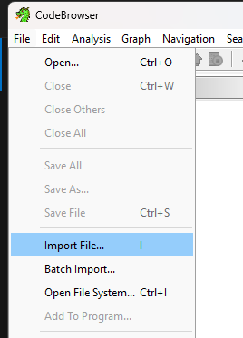
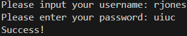

# EOH Reverse Engineering Puzzles

For use with Ghidra. wcs_demo is an easier puzzle to demonstrate how to use Ghidra. wcs_puzzle is the actual puzzle used.

## Setup

1. Go grab a copy of Ghidra from: https://github.com/NationalSecurityAgency/ghidra/releases

2. Follow Ghidra install instructions: https://htmlpreview.github.io/?https://github.com/NationalSecurityAgency/ghidra/blob/Ghidra_11.0.2_build/GhidraDocs/InstallationGuide.html. TL;DR is Ghidra requires Java 17, and you run the script in the working directionary to launch the application.

3. Go to File -> New Project:

    

4. Create new shared project, then select a directory to place the project:

    

5. Open CodeBrowser:

    

6. Go to File -> Open:

    

7. Import the demo file (when you do the actual puzzle, import the other file):

    

8. Click through the dialogs (Click 'Yes' to analyze the file, click Analyze, then Ok)

9. On the left-hand side under symbol tree, expand the functions folder:

    

10. `entry` is where the execuable starts when you run it. Double click this.

11. The center window is the disambler (raw x86 instructions), the right window is the decomplier. We'll ignore the center window and only look at the decomplier:

    

12. Notice how the `entry` function immediately runs `FUN_0010123f`. Double click on this function in the symbol tree:

    

13. Now there's more interesting stuff here. The user is prompted with a `printf` statement then gives the program input through `fgets`. These are stored to local variables `local_218` and `local_118`, then passed into function `FUN_001011e9`. Double click on this next:

    

14. Ah-ha! There's some plaintext string comparisions here. The first parameter is the username and the second is the password. We now know what to pass into the program!

    

15. You now have a basic understanding of how to use Ghidra. Try cracking wcs_puzzle! :)